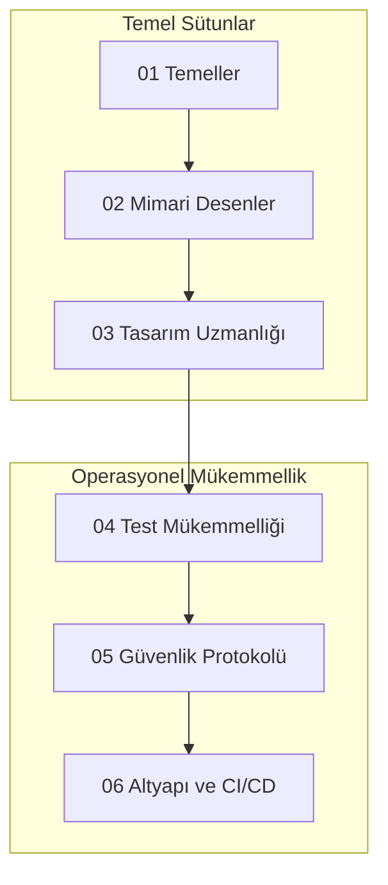

# 🚀 API Mastery Yol Haritası: Temelden Orkestrasyona

**API Mastery Yol Haritası**'na hoş geldiniz—sizi bir geliştiriciden yüksek yetkili bir API Mimarı ve Güvenlik Uzmanına dönüştürmek için tasarlanmış, dünya standartlarında, çok disiplinli bir müfredat.

---

## 🏛️ API-First Felsefesi

Modern yazılım dünyasında API, sadece bir "eklenti" değil, sistemin **çekirdek varlığıdır**. "API-First" yaklaşımı, kod yazılmadan önce **kontratın** tasarlanmasını, test edilmesini ve dökümante edilmesini savunur. Bu yol haritası, bu felsefeyi merkeze alarak sadece "nasıl" yapıldığını değil, "neden" yapıldığını da öğretir.

## 🗺️ API Yaşam Döngüsü Topolojisi

---

## 🏗️ Müfredat Genel Bakış

> [!TIP]
> API dünyasına ilk adımı atmak için: **[API Nedir? (Teknik Derin Dalış)](API-Nedir.md)** rehberimizi okuyun.

### [01. Temeller: Çekirdek Mekanikler](01-Foundations/)
*   **Protokoller**: HTTP/1.1, HTTP/2 (Multiplexing), HTTP/3 (QUIC/UDP).
*   **Veri Formatları**: JSON (RFC 8259), XML, Protocol Buffers, Avro.
*   **Durum Yönetimi**: Statelessness vs Stateful mimariler.

### [02. Mimari Desenler](02-Architectural-Patterns/)
*   **RESTful Mimarisi**: Richardson Olgunluk Modeli (Level 0-3).
*   **Agnostik Protokoller**: GraphQL (Query/Mutation/Subscription), gRPC, Thrift.
*   **Olay Odaklı API'lar**: Webhooks, WebSockets, SSE ve Long Polling.

### [03. Tasarım Uzmanlığı](03-Design-Mastery/)
*   **Semantik Adlandırma**: CRUD yerine Resource-Action eşleşmeleri.
*   **HATEOAS**: Uygulama durumunun motoru olarak hipermedya.
*   **Resilience Desenleri**: Retry (Yeniden Deneme), Circuit Breaker (Devre Kesici), Timeout.

### [04. Test Mükemmelliği](04-Testing-Excellence/)
*   **Doğrulama**: JSON/XML Schema Validation.
*   **Kontrat Testi**: Tüketici-Yönlendirmeli (Consumer-Driven) Kontratlar.
*   **Yük Testi**: K6, Artillery ve BlazeMeter ile ölçeklenebilirlik analizi.

### [05. Güvenlik Protokolü](05-Security-Protocol/)
*   **Modern Auth**: OAuth 2.1 Standardı, PKCE Flow, OpenID Connect.
*   **Zırhlama**: SQL Injection, NoSQL Injection ve Insecure Deserialization korumaları.
*   **Analiz**: API Discovery ve Atıl (Shadow) API tespiti.

### [06. Altyapı ve CI/CD](06-Infrastructure-CI-CD/)
*   **Orkestrasyon**: API Gateways (Envoy, Kong), Service Mesh (Istio).
*   **Dökümantasyon Otomasyonu**: Swagger UI, Redoc ve OpenAPI Spec.
*   **Gözlemlenebilirlik**: 3 Sütun (Logs, Metrics, Traces).

---

## 📊 Uzmanlık Matrisi (Skill Matrix)

| Seviye | Odak Noktası | Beceri Seti |
| :--- | :--- | :--- |
| **Başlangıç** | Tüketim ve Temeller | HTTP Metotları, Postman Kullanımı, JSON Okuma. |
| **Orta Segment** | Tasarım ve Otomasyon | REST Prensipleri, Newman/Newman Scripts, Swagger UI. |
| **Usta Mimari** | Güvenlik ve Altyapı | OAuth2 Implementasyonu, API Gateway Yönetimi, K6 Yük Analizi. |
| **Architect** | Strateji ve Vizyon | API-First Kültürü, Hizmet Örgüsü (Mesh), Zaza-Scale Güvenlik. |

---

## 🛠️ Ekosistem ve Araçlar (Tools & Ecosystem)

*   **Tasarım**: Stoplight, Swagger Editor, Insomnia.
*   **Test**: Postman, Hoppscotch, RestAssured, Cypress.
*   **Güvenlik**: Burp Suite, OWASP ZAP, 42Crunch.
*   **İzleme**: Datadog, New Relic, Grafana, Honeycomb.

---

## 🎓 Öğrenme Metodolojisi
1.  **Iterative Study**: Önce teoriyi oku (`API-Nedir.md`), sonra laboratuvarı (`/labs`) yap.
2.  **Architecture-First**: Kod yazmadan önce OpenAPI şemasını (`yaml`) tasarla.
3.  **Security-Mindset**: Her zaman en kötü senaryoyu düşün (Örn: "Ya token çalınırsa?").

---

## ✍️ Hazırlayan ve Katkıda Bulunanlar
**Bahattin Yunus Çetin**  
*Yazılım Mimarı | Multi-Disciplinary Systems Designer | Solopreneur*

---
> "Geleceğin dünyası API'lar üzerine inşa edilecek. Bu dünyada bir mimar mı olacaksınız yoksa sadece bir kullanıcı mı?"