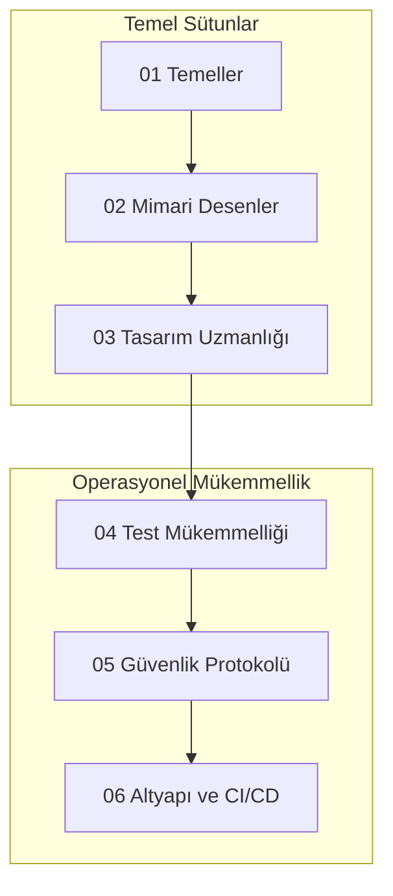

# 🚀 API Mastery Yol Haritası: Temelden Orkestrasyona

**API Mastery Yol Haritası**'na hoş geldiniz—sizi bir geliştiriciden yüksek yetkili bir API Mimarı ve Güvenlik Uzmanına dönüştürmek için tasarlanmış, dünya standartlarında, çok disiplinli bir müfredat. Bu depo sadece bir rehber değil; modern yazılım orkestrasyonu için akademik bir merkezdir.

## 🗺️ API Yaşam Döngüsü Topolojisi

---

## 🏛️ Müfredat Genel Bakış

Yol haritası, web'in temel mekanizmalarından karmaşık altyapı orkestrasyonuna kadar ilerleyen altı stratejik modülden oluşmaktadır.

### [01. Temeller: Çekirdek Mekanikler](01-Foundations/)
*   **Protokollere Derin Dalış**: HTTP/1.1 vs HTTP/2 vs HTTP/3 (QUIC).
*   **Veri Serileştirme**: JSON Schema, XML/DTD, Protocol Buffers.
*   **Mimari Stiller**: REST'in gerçek anlamı (HATEOAS) vs SOAP.

### [02. Mimari Desenler](02-Architectural-Patterns/)
*   **GraphQL**: Şema tasarımı, Resolver'lar ve N+1 problemi.
*   **gRPC**: Protobuf ile yüksek performanslı RPC.
*   **Reaktif API'lar**: Webhook'lar, WebSocket'ler ve Server-Sent Events (SSE).

### [03. Tasarım Uzmanlığı](03-Design-Mastery/)
*   **Adlandırma Kuralları**: Kaynak odaklı (resource-oriented) tasarım.
*   **Versiyonlama**: Header vs URI vs Media Type versiyonlama.
*   **Gelişmiş Desenler**: Idempotency, Rate Limiting, Filtreleme ve Sayfalama.

### [04. Test Mükemmelliği: Kalite Birinci Sınıf Vatandaştır](04-Testing-Excellence/)
*   **Otomasyon**: Postman/Newman, RestAssured (Java), Playwright (JS).
*   **Performans**: K6 ve JMeter ile Yük ve Stres testleri.
*   **Doğrulama**: Kontrat Testi (Pact) ve Şema Doğrulaması.

### [05. Güvenlik Protokolü: Geçidi Sertleştirmek](05-Security-Protocol/)
*   **Kimlik Doğrulama**: OAuth 2.1, OIDC ve JWT derinlemesine inceleme.
*   **Zafiyet Yönetimi**: OWASP API Security Top 10.
*   **Savunma Katmanları**: CORS, CSP, Rate Limiting ve IP Beyaz Listeye Alma.

### [06. Altyapı ve CI/CD](06-Infrastructure-CI-CD/)
*   **API Gateway'ler**: Kong, Tyk ve AWS API Gateway.
*   **Gözlemlenebilirlik**: OpenTelemetry, Prometheus ve Grafana.
*   **Modern DevOps**: OpenAPI (Swagger) üzerinden SDK üretimi ve GitHub Actions.

---

## 🛠️ Bu Yol Haritası Nasıl Kullanılır?
1.  **01'den Başlayın**: Deneyimli olsanız bile, temeller usta düzeyinde sorun gidermenin sırlarını barındırır.
2.  **Uygulamalı Laboratuvarlar**: Her modül pratik egzersizler içeren bir `/labs` dizini içerir.
3.  **Katkıda Bulunun**: Bu yaşayan bir belgedir. Yeni desenler veya güvenlik güncellemeleri için PR gönderin.

---

## ✍️ Hazırlayan
**Bahattin Yunus Çetin**  
*Multi-Disciplinary Systems Designer | Solopreneur*

---
> "API, sisteminiz ile dünya arasındaki kontrattır. Onu kırılmaz kılın."